# Inference Optimization: A Founder Handbook

**Audience:** an experienced ML engineer rebuilding computer-architecture depth to found an inference-optimization company.

**Focus:** autoregressive LLM inference first. The principles also transfer to speech, vision, diffusion, and recommendation workloads.

**Research date:** 2026-09-01.

---

## How To Read This

Each chapter uses three labels:

- **Invariant:** follows from model math or general computer architecture.
- **Typical:** common in current LLM systems, but measure it.
- **Version-sensitive:** depends on the model, runtime, driver, or hardware generation.

The central discipline is:

> Do not ask, “Which optimization is fastest?” Ask, “Which resource limits this workload under this SLO?”

An optimization is useful only if it improves the workload's Pareto frontier: quality, latency, throughput, reliability, and cost.

---

# Six-Week Curriculum

| Week | Theme | You should be able to answer | Lab |
|---|---|---|---|
| 1 | Hardware and measurement | Where are bytes stored and moved? What is the bottleneck? | KV sizing and roofline estimates |
| 2 | Transformer inference | What changes between prefill and decode? Why cache K and V? | Implement cached attention |
| 3 | KV-cache systems | How do allocation, paging, reuse, compression, and offload trade memory for time? | Cache simulator |
| 4 | Kernels and model execution | When do FlashAttention, quantization, fusion, graphs, and speculation help? | MPS benchmark and profile |
| 5 | Serving systems | How do batching, scheduling, parallelism, and disaggregation determine SLO goodput? | Workload scheduler simulator; optional CUDA profile |
| 6 | Founder capstone | Which pain is expensive, repeated, measurable, and poorly solved? | Inference Economics CI prototype |

Recommended pace: 60-90 minutes of reading and 60-120 minutes of lab work per day, five days per week.

---

# Week 1: Rebuild The Machine Model

## 1.1 Inference Is A Data-Movement Problem

A processor cannot operate on data merely because the data exists. The bytes must reach the execution units.

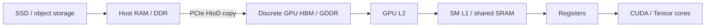

This diagram is specifically for a conventional discrete PCIe GPU. Integrated systems such as Apple Silicon use shared physical DRAM, while tightly coupled CPU-GPU superchips may use coherent chip-to-chip links. Do not merge those topologies into one diagram.

Capacity usually rises to the left. Bandwidth rises and latency falls to the right. Exact numbers depend on hardware.

Two consequences drive inference optimization:

1. A FLOP is useful only when its operands arrive on time.
2. Reusing data near compute is often more valuable than reducing a few arithmetic operations.

FlashAttention, kernel fusion, quantization, prefix caching, PagedAttention, and batching are all, in different ways, data-movement optimizations.

## 1.2 CPU, GPU, And NPU

### CPU

A CPU spends silicon on a few powerful cores, large coherent caches, branch prediction, out-of-order execution, and low-latency control flow. It is strong for:

- Tokenization and request parsing
- Scheduling
- Branch-heavy logic
- Small workloads
- Unsupported accelerator operations

### GPU

A GPU uses many lightweight threads and matrix engines to maximize throughput. NVIDIA's model groups threads into warps, blocks, and grids; blocks execute on streaming multiprocessors (SMs). It is strong when work has enough parallelism and regularity.

Do not compare “GPU cores” with CPU cores. They are not equivalent units.

### NPU / TPU / ASIC

`NPU` is a category, not a common instruction set. Neural accelerators usually favor supported matrix/dataflow workloads at lower precision. Google's TPUs use matrix-multiply units based on systolic arrays, plus vector and scalar units. Apple Neural Engine, AWS Inferentia, and mobile NPUs have different compilers, operators, memory models, and profiling tools.

Choose an accelerator using:

- Supported model operators
- Precision and quantization support
- Weight and KV capacity
- Sustained memory bandwidth
- Decode performance at your batch size
- Compiler maturity and dynamic-shape behavior
- Interconnect topology
- Energy, latency, throughput, and cost

TOPS alone is not a useful purchasing metric.

## 1.3 Discrete Versus Unified Memory

### Discrete NVIDIA-style system

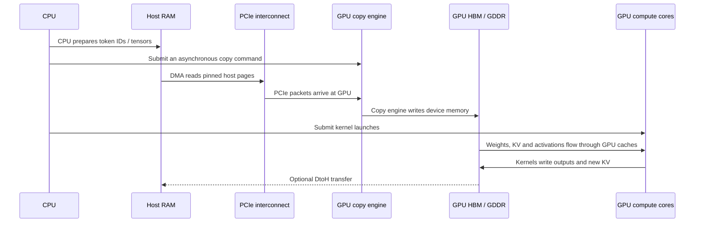

The blocks above are physically distinct:

- **CPU package:** execution cores, registers, L1/L2 caches, often a shared last-level cache, a memory controller, and usually the PCIe root complex.
- **Host RAM:** separate DDR DIMMs connected to the CPU's memory controller through DDR channels. RAM stores the operating system, Python process, tokenizer data, model files during loading, and ordinary CPU tensors.
- **Discrete GPU processor:** streaming multiprocessors, registers, shared SRAM/L1, L2, copy engines, and compute pipelines. Kernels execute here.
- **GPU memory:** HBM or GDDR attached to the GPU through its own memory controllers and a wide local memory interface. Model weights, KV cache, activations, and workspaces normally live here during inference.

The CPU is therefore not RAM. A CPU core first searches its caches; on a miss, its memory controller fetches cache lines from host RAM over DDR channels.

### What is an interconnect?

An **interconnect** is the complete communication path between components. The word covers:

- The physical electrical lanes, wires, or package links
- Controllers at each endpoint
- The protocol used to address, order, and transfer commands and data
- Its bandwidth, latency, coherence rules, and topology

One computer contains several different interconnects:

| Boundary | Common interconnect | Purpose |
|---|---|---|
| CPU ↔ host RAM | DDR memory channels | CPU cache-line reads and writes |
| CPU/host ↔ discrete GPU | PCI Express | Commands and host/device data transfers |
| GPU compute ↔ GPU memory | GPU-local HBM/GDDR memory interface | High-bandwidth weight, KV, and activation access |
| GPU ↔ GPU | PCIe or NVLink | Peer transfers and distributed collectives |
| CPU ↔ GPU in an integrated superchip | For example, NVLink-C2C | Tightly coupled, potentially coherent chip-to-chip access |

A typical server with a discrete PCIe GPU uses **PCIe** for the CPU/host-to-GPU boundary. NVLink is more commonly a GPU-to-GPU fabric. NVLink-C2C is used in special tightly integrated systems and should not be treated as the default discrete-GPU path.

PCIe is packet-based and has finite bandwidth and non-zero latency. GPU-local HBM bandwidth is usually much higher. This gap is why repeatedly moving model weights or active KV state from host RAM to the GPU during generation is usually expensive.

### Who performs a host-to-device copy?

The CPU submits a transfer command through the CUDA runtime/driver. A DMA-capable GPU **copy engine** can then read pinned host-memory pages over PCIe and write the bytes into GPU memory. The CPU does not execute a load/store instruction for every transferred byte.

Pinned memory matters because its physical pages cannot be swapped out while DMA is using them. Pageable host memory commonly requires the CUDA runtime to stage data through a pinned buffer before transfer.

CUDA streams and dependency events determine when later kernels may consume the copied data. A copy can overlap compute only when the source is suitable, a separate stream is used, the hardware has an available copy engine, and there is no dependency forcing serialization.

Ordinary CUDA tensors use device memory. CPU-to-GPU and GPU-to-CPU movement appears as `Memcpy HtoD` and `Memcpy DtoH` in PyTorch Profiler or Nsight Systems.

### What moves during LLM inference?

| Stage | Typical movement | Desired design |
|---|---|---|
| Model load | SSD → host RAM → PCIe → GPU memory | Transfer weights once, then keep them resident |
| Request preparation | Text/tokenizer on CPU; token IDs and metadata to GPU | Transfer compact IDs rather than large activations |
| Prefill | GPU reads resident weights and writes prompt KV in GPU memory | Keep model execution and intermediates on device |
| Decode | Every step reads resident weights and growing KV; a small token result may return | Avoid moving logits or KV to CPU each step; sample on device when practical |
| KV offload | GPU memory ↔ PCIe ↔ pinned host RAM | Use only when capacity savings justify transfer latency; prefetch and overlap |

The largest transfer often happens during model loading. Once serving starts, a well-designed inference loop keeps weights and active KV cache in GPU memory. It does **not** copy the full model from CPU to GPU for every token.

Pinned host memory allows direct DMA and can enable copy/compute overlap when:

1. The source is pinned.
2. The copy uses a separate non-default stream.
3. The GPU has a free copy engine.

Calling `.pin_memory()` immediately before one copy may be slower because pinning itself copies and blocks. DataLoader pinning is useful because a separate thread can prepare pinned batches ahead of use.

### Apple Silicon unified memory

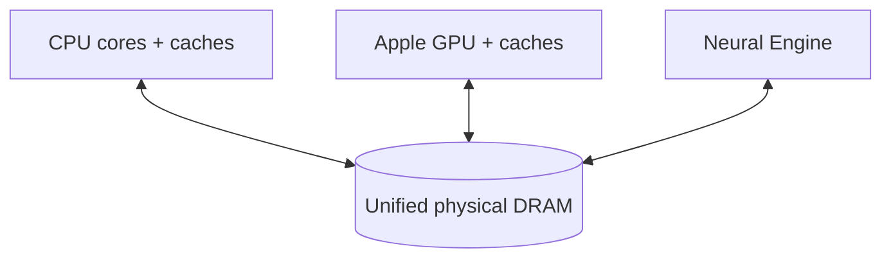

The CPU and GPU share physical DRAM. There is no discrete PCIe copy into VRAM, but this does **not** mean:

- Every device sees identical latency.
- Data layout conversion is free.
- CPU and GPU caches are the same.
- Synchronization disappears.
- All 16 GB is safely available to the model.

MPS may still allocate Metal buffers, perform blits, or materialize non-contiguous views. PyTorch normally errors on an unsupported MPS operation. Optional CPU fallback requires `PYTORCH_ENABLE_MPS_FALLBACK=1`, covers only some operations, and can add hidden copies. CPU and GPU also compete for the same DRAM bandwidth.

## 1.4 Roofline Reasoning

Arithmetic intensity is:

\[
I=\frac{\text{operations}}{\text{bytes moved}}
\]

The roofline upper bound is:

\[
P_{attainable}\leq\min(P_{peak},I\times BW_{peak})
\]

Equivalently, runtime cannot beat:

\[
t\geq\max\left(\frac{F}{P_{peak}},\frac{Q}{BW_{peak}}\right)
\]

where:

- \(F\) is work in FLOPs.
- \(Q\) is traffic in bytes at the memory level being studied.
- \(P_{peak}\) is peak math throughput.
- \(BW_{peak}\) is peak bandwidth.

Always name the memory level. HBM roofline and PCIe roofline answer different questions.

### Bottleneck classes

| Evidence | Likely limit | First ideas |
|---|---|---|
| High tensor-core use, lower memory pressure | Compute | Lower precision, better kernels, fewer FLOPs |
| High HBM traffic, low arithmetic intensity | Memory bandwidth | Quantize, fuse, shrink KV, increase reuse |
| GPU gaps, CPU busy | Host / launch | Batch, compile, CUDA graphs, move sampling on-device |
| Repeated HtoD/DtoH | Transfer | Keep tensors device-resident, batch copies, overlap |
| Low GPU work and tiny kernels | Insufficient parallelism | Batch, fuse, specialized decode kernels |
| OOM or falling cache capacity | Memory capacity | GQA/MQA, paging, quantized/offloaded KV, shorter context |
| Queue time dominates | Scheduler/capacity | Admission control, autoscale, scheduling policy |

## Week 1 Exercises

1. Run `labs/01_kv_cache_math.py` for three model shapes.
2. Explain why a single-token linear layer can be memory-bound even if it performs billions of operations.
3. Draw the physical memory path for your M2 Pro and for an H100 PCIe server.
4. State what evidence would distinguish compute-bound from memory-bound decode.

---

# Week 2: Autoregressive Transformer Inference

## 2.1 Attention Shapes

For a decoder layer with hidden states \(X\in\mathbb{R}^{B\times T\times d_{model}}\):

\[
Q=XW^Q,\quad K=XW^K,\quad V=XW^V
\]

After splitting heads:

\[
Q\in\mathbb{R}^{B\times H_q\times T\times d_h}
\]

\[
K,V\in\mathbb{R}^{B\times H_{kv}\times T\times d_h}
\]

For query head \(h\), let \(g(h)\) select its KV head:

\[
A_h=\operatorname{softmax}\left(\frac{Q_hK_{g(h)}^T}{\sqrt{d_h}}+M\right)
\]

\[
O_h=A_hV_{g(h)}
\]

The causal mask \(M\) prevents a position from seeing future tokens.

## 2.2 Autoregressive Dependency

\[
p(x_{1:n})=\prod_{t=1}^{n}p(x_t\mid x_{<t})
\]

Within one sampled sequence, you must select token \(t\) before evaluating the path conditioned on it for token \(t+1\). You can parallelize:

- Prompt positions during prefill
- Different requests
- Heads and matrix dimensions
- Candidate tokens during speculative verification

You cannot ordinarily generate all future sampled positions in parallel.

### Attention FLOP convention

Count one multiply and one add as two FLOPs. For batch \(B\), query length \(T_q\), key length \(T_k\), \(H_q\) query heads, and head size \(d_h\), the two attention matrix products require approximately:

\[
F_{attention}\approx4BH_qT_qT_kd_h
\]

For useful causal prefill work, only the lower triangle is valid:

\[
F_{causal\ prefill}\approx2BH_qT(T+1)d_h
\]

A kernel that evaluates the full square before masking can execute closer to \(4BH_qT^2d_h\).

For one decode step with current context \(S\):

\[
F_{decode\ attention}\approx4BH_qSd_h
\]

These figures exclude Q/K/V projections, output projection, feed-forward layers, normalization, softmax overhead, and non-matmul instructions. State whether a number is useful algorithmic work or executed kernel work.

## 2.3 Prefill Versus Decode

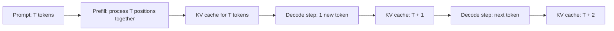

### Prefill

- Processes the prompt.
- Creates a KV entry for every prompt token at every cached layer.
- Uses large matrix operations.
- Dense full attention work grows quadratically with prompt length.
- Often compute-friendly, but not always compute-bound.

### Decode

- Processes one selected token per active sequence per step.
- Appends one K and one V vector per cached layer.
- Reads earlier K/V to attend over context.
- Repeatedly streams weights.
- Often memory-bandwidth or launch limited at low batch.

### Metrics

- **TTFT:** request arrival to first output token.
- **Queue time:** request arrival to admission/execution.
- **Prefill time:** model time processing prompt.
- **TPOT:** decode duration divided by generated token count under a stated convention.
- **ITL:** observed interval between streamed tokens/chunks. Tool definitions vary.
- **End-to-end latency:** request arrival to completion.
- **Goodput:** requests/tokens meeting quality and SLO, not merely processed.

Publish metric boundaries. “Latency” alone is ambiguous.

## 2.4 Why The KV Cache Exists

Past keys and values do not change when one token is appended.

Without a cache, step \(t\) recomputes K and V for all \(t\) positions. With a cache, it computes K and V only for the new token, then reads cached history.

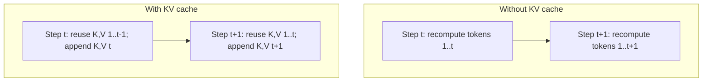

The cache stores layer-specific K and V tensors. It does not normally store every activation or output logit.

The cache removes redundant projection and layer computation. It does **not** make full-attention decode constant-time: each step still attends over a context whose length grows.

## 2.5 Exact Conventional KV Memory Formula

For conventional per-layer K/V caches with uniform decoder layers:

\[
\boxed{M_{KV}=2BLSH_{kv}d_hb}
\]

where:

- \(B\): cached sequences
- \(L\): cached self-attention layers
- \(S\): tokens per sequence
- \(H_{kv}\): KV heads
- \(d_h\): elements per KV head
- \(b\): bytes per element
- `2`: one K and one V

Per token per sequence:

\[
\boxed{m_{KV/token}=2LH_{kv}d_hb}
\]

For unequal sequence lengths:

\[
M_{KV}=2LH_{kv}d_hb\sum_i S_i
\]

This is the logical payload. Physical memory also includes block padding, allocator alignment, quantization scales, block tables, temporary workspaces, and replication.

### Worked example

For 32 layers, 32 query heads, head size 128, 4096 tokens, BF16/FP16 cache:

| Attention | KV heads | Cache per sequence |
|---|---:|---:|
| MHA | 32 | 2 GiB |
| GQA-8 | 8 | 512 MiB |
| MQA | 1 | 64 MiB |

The reduction is architectural. You cannot turn an arbitrary MHA checkpoint into MQA with a runtime flag and expect unchanged behavior.

## 2.6 MHA, GQA, MQA

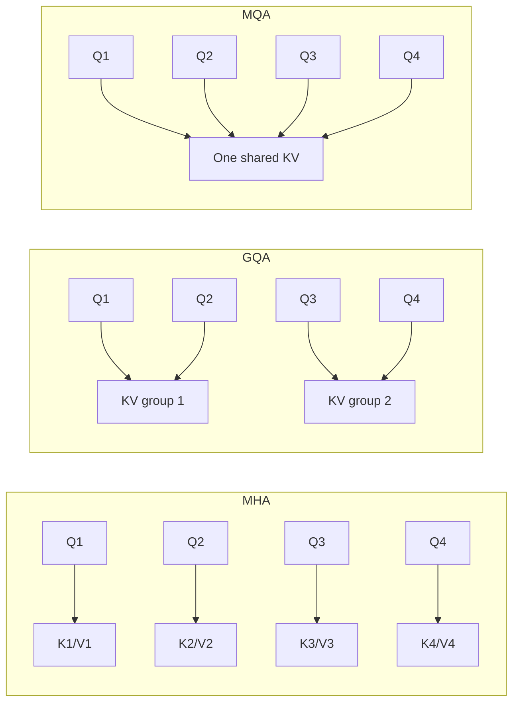

- **MHA:** one K/V head per query head.
- **GQA:** groups of query heads share K/V.
- **MQA:** every query head shares one K/V head.

Relative logical KV memory:

\[
\frac{M_{GQA}}{M_{MHA}}=\frac{H_{kv}}{H_q}
\]

MQA/GQA can also reduce decode KV bandwidth. Under tensor parallelism, KV-head replication can reduce the ideal savings.

## Week 2 Exercises

1. Complete `labs/02_attention_cache_demo.py`.
2. Derive KV memory for a model using local attention in half its layers.
3. Explain why FlashAttention does not remove the decode KV cache.
4. Explain why batching improves weight arithmetic intensity.

---

# Week 3: KV Cache From Tensor To Memory System

## 3.1 Contiguous Static Cache

Reserve every sequence to a maximum length:

```text
request A: [used used used free free free free free]
request B: [used free free free free free free free]
request C: [used used used used used free free free]
```

Advantages:

- Stable addresses and tensor shapes
- Friendly to compilation and graph capture
- Simple indexing

Costs:

- Unused future slots consume memory
- A long maximum penalizes short requests
- Naive kernels may do masked work over unused capacity

## 3.2 Dynamic Contiguous Cache

Grow the cache with sequence length.

Advantages:

- Lower initial reservation
- Natural for simple single-request generation

Costs:

- Reallocation or copies in naive implementations
- Shape changes complicate compilation and CUDA graphs
- Variable allocations fragment memory under serving load

Do not confuse dynamic cache with dynamic/continuous batching.

## 3.3 Paged KV Cache

PagedAttention borrows virtual-memory ideas. A request sees a logical sequence of blocks while the allocator maps them to non-contiguous physical blocks.

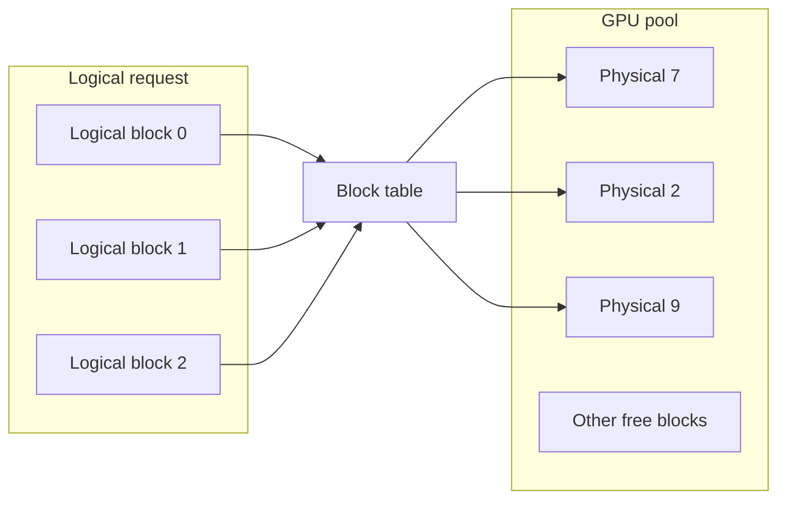

It solves allocation and fragmentation problems. It does not make attention sparse and does not remove \(O(S)\) work for one full-attention decode step.

For block size \(C\), allocated token slots are:

\[
\widetilde S_i=C\left\lceil\frac{S_i}{C}\right\rceil
\]

Tail waste per request is less than one block:

\[
0\le W_i<C\,m_{KV/token}
\]

Block-size trade-off:

- Larger: fewer table entries, potentially better kernel efficiency
- Smaller: less tail waste, finer prefix reuse

## 3.4 Prefix Caching

If two requests have an identical token prefix under identical model state, their prefix KV can be reused.

```text
Request A: [system prompt][large document][question A]
Request B: [system prompt][large document][question B]
           <------ reusable prefix ------>
```

Reuse requires more than semantic similarity. The cache identity may need:

- Exact token IDs and positions
- Model/checkpoint revision
- Adapter/LoRA identity
- Multimodal input identity
- Cache precision/layout
- Tenant or security salt

Prefix caching primarily reduces repeated prefill and TTFT. It does not reduce ordinary decode work after the shared prefix.

In multi-tenant systems, cache timing can leak whether content was already cached. Isolate trust groups with cache salts or separate pools.

## 3.5 KV Quantization

Quantize K and V to reduce capacity and read traffic.

Ideal reduction:

\[
\text{compression}\approx\frac{\text{native bits}}{\text{quantized bits}}
\]

Real savings are smaller because of scales, metadata, alignment, and sometimes a recent full-precision residual window.

Trade-offs:

- More concurrent sequences or longer context
- Potentially less memory bandwidth
- Quantize/dequantize overhead
- Accuracy sensitivity by layer, head, key/value distribution, and context

FP8 is common in current datacenter runtimes. Research systems explore 2-4 bit caches with per-channel, per-token, outlier-aware, or pre-RoPE strategies. Treat sub-8-bit results as model/backend-specific until verified.

Weight quantization and KV quantization are separate decisions.

## 3.6 KV Offload And Tiering

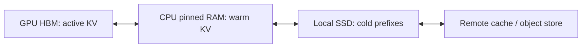

Transfer lower bound:

\[
t_{transfer}\ge\frac{bytes}{effective\ bandwidth}
\]

Offload is useful when avoided recomputation is more expensive than lookup and movement.

Good candidates:

- Inactive sessions
- Reusable long prefixes
- Requests paused for tools or humans
- Capacity-constrained GPUs where latency can be traded

Bad candidate:

- Moving the full active KV over PCIe for every decode token

Prefetch and overlap are essential. The cache policy needs to predict reuse, not merely find free storage.

## 3.7 Sliding Window And Bounded State

For a sliding window \(W\), each sliding layer retains at most \(W\) recent positions. For equal-length sequences in a batch:

\[
M_{SWA}\le2BL_{SWA}WH_{kv}d_hb
\]

For unequal lengths:

\[
M_{SWA}=2L_{SWA}H_{kv}d_hb\sum_i\min(S_i,W)
\]

A circular buffer can store token \(t\) at \(t\bmod W\).

This bounds memory and attention work, but it is not exact full-context attention. Information may propagate through stacked layers, but old tokens are not directly available to every query.

State-space and linear-attention models use different recurrent state rather than a conventional KV cache. Their state and quality trade-offs should be studied separately.

## 3.8 Modern Cache Taxonomy

| Technique | Saves | Costs / risks | Best when |
|---|---|---|---|
| Static cache | Compile/launch overhead | Reserved memory, padding | Stable shapes/lengths |
| Dynamic cache | Initial memory | Reallocation, graph instability | Simple or varied generation |
| Paged cache | Fragmentation and reservation | Indirection, block management | Multi-request serving |
| Prefix cache | Repeated prefill | Lookup, eviction, security | Shared long prefixes |
| Quantized KV | Capacity and bandwidth | Quality, conversion overhead | Long context/high concurrency |
| CPU offload | GPU capacity | PCIe latency/bandwidth | Inactive or warm state |
| Remote tier | Fleet reuse/capacity | Network and consistency | Long-lived reusable prefixes |
| Sliding window | Bounded state | Less direct context | Compatible trained models |
| GQA/MQA | KV capacity/bandwidth | Model quality/design trade-off | Compatible checkpoints |
| Latent KV / MLA | Stores a compressed latent state instead of standard per-head K/V | Architecture-specific kernels and reconstruction | Compatible trained models |
| Cross-layer sharing | Reuses K/V or state across layers | Less layer-specific capacity | Compatible trained models |
| Hybrid per-layer cache | Mixes full, sliding/chunked, latent, or recurrent states | More complex allocation and kernels | Hybrid model architectures |

The boxed formula in section 2.5 does not directly apply to latent-attention or recurrent-state architectures. Derive memory from the actual state stored by each layer.

## Week 3 Exercises

1. Run `labs/03_kv_paging_sim.py` with different block and sequence-size distributions.
2. Calculate the break-even reuse probability for offloading a prefix to CPU.
3. Design a cache key for a multi-tenant LoRA service.
4. Explain why prefix caching can improve TTFT but not TPOT.

---

# Week 4: Kernels And Execution

## 4.1 FlashAttention

Standard attention can materialize a \(T\times T\) score matrix in HBM. FlashAttention tiles Q, K, and V through on-chip SRAM and uses online softmax to avoid that materialization.

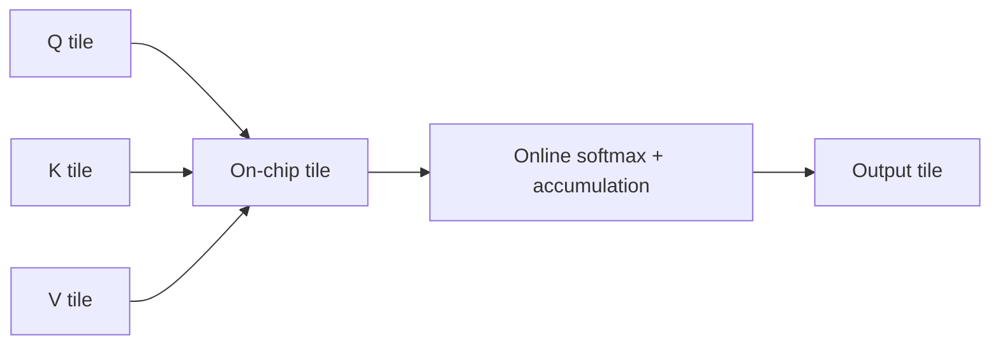

Key facts:

- Exact attention, subject to normal floating-point ordering differences
- Reduces HBM reads/writes
- Full dense prefill arithmetic remains quadratic
- Does not compress the persistent KV cache

Decode has query length one and exposes different parallelism. Specialized decode kernels split work across KV blocks, heads, or sequence partitions and combine online-softmax statistics.

## 4.2 Kernel Fusion

Unfused:

```text
read -> RMSNorm -> write -> read -> projection -> write -> read -> RoPE -> write
```

Fused:

```text
read -> RMSNorm + projection + RoPE -> write
```

Fusion reduces launches and intermediate HBM traffic. Too much fusion may increase registers/shared memory, lower occupancy, create spills, and specialize too narrowly.

Measure the fused kernel, not the number of kernels.

## 4.3 Quantization

Memory for \(N\) parameters at \(b\) bytes per stored element:

\[
M_W\approx Nb+M_{scales}+M_{metadata}
\]

Quantization may improve:

- Capacity
- Weight bandwidth
- Cache residency
- Cost per replica

It may hurt:

- Model quality
- Kernel availability
- Conversion overhead
- Small-batch latency when dequantization dominates

Distinguish:

- Weight-only quantization
- Weight-and-activation quantization
- KV-cache quantization
- Quantized compute versus storage-only compression

The right metric is SLO-good, quality-passing work per dollar.

## 4.4 CUDA Graphs And Compilation

CUDA graphs capture a repeated launch DAG and replay it with lower host/driver overhead. They do not reduce model FLOPs or HBM traffic.

Benefits:

- Fewer Python/driver launches
- Better low-batch decode latency

Costs:

- Dynamic shapes need buckets, padding, updates, or eager fallback
- Graph pools consume memory
- Warmup and capture increase startup time

Static KV caches often help graph capture by stabilizing addresses and shapes, at the cost of reserved memory.

On MPS, graph compilation and Metal dispatch differ from CUDA graphs; use Instruments rather than assuming CUDA behavior.

## 4.5 Speculative Decoding

A draft model proposes \(\gamma\) tokens. The target verifies them in parallel.

```mermaid
sequenceDiagram
    participant D as Draft model
    participant T as Target model
    D->>D: Propose gamma tokens cheaply
    D->>T: Candidate block
    T->>T: Verify candidates in one target pass
    T-->>D: Accept prefix; correct rejection
```

For independent mean acceptance probability \(\alpha\), the expected number of accepted **draft** tokens is:

\[
E[accepted\ draft]=\frac{\alpha(1-\alpha^\gamma)}{1-\alpha}
\]

The expected output progress per target verification, including the correction or bonus token, is:

\[
E[output\ progress]=\frac{1-\alpha^{\gamma+1}}{1-\alpha}
\]

At \(\alpha=1\), use the limits \(E[accepted\ draft]=\gamma\) and \(E[output\ progress]=\gamma+1\).

It reduces serial target calls, not necessarily FLOPs. It helps when:

- Drafting is cheap
- Acceptance is high
- Target calls are the bottleneck
- Batch is not already saturating target compute

Correct rejection sampling preserves the target distribution up to numerical behavior. Greedy variants have different correctness conditions.

## 4.6 MPS Profiling

Your M2 Pro uses unified memory. Use three evidence layers:

1. Unprofiled synchronized timing
2. PyTorch MPS signposts / Xcode Instruments timeline
3. Memory and system-pressure counters

Timing:

```python
torch.mps.synchronize()
start = time.perf_counter()
run_region()
torch.mps.synchronize()
elapsed = time.perf_counter() - start
```

MPS signposts:

```python
with torch.mps.profiler.profile(mode="interval,event"):
    run_region()
    torch.mps.synchronize()
```

Inspect in Xcode Instruments:

- CPU scheduling gaps
- Metal command-buffer submission
- GPU dispatches
- Blit/copy activity
- CPU fallback
- Memory bandwidth and pressure

`torch.profiler` has no MPS device activity equivalent to `ProfilerActivity.CUDA`; CPU operator time may only show enqueue work.

## 4.7 CUDA Profiling

Use tools at different levels:

| Tool | Question |
|---|---|
| PyTorch Profiler | Which framework operators, copies, allocations, and kernels occur? |
| Nsight Systems | Where are CPU, GPU, copies, streams, and waits on one timeline? |
| Nsight Compute | Why is one kernel slow? Compute, memory, occupancy, or stalls? |
| `nvidia-smi` / DCGM | What does the fleet do over time? |

Nsight Systems reveals `Memcpy HtoD`, `DtoH`, and `DtoD`. Nsight Compute's roofline and memory workload sections diagnose individual kernels. Do not use a replayed Nsight Compute kernel time as end-to-end service latency.

## Week 4 Exercises

1. Run `labs/04_mps_inference_profile.py` and inspect synchronized timings.
2. Install full Xcode and capture a Metal System Trace.
3. On an NVIDIA machine, run `labs/05_cuda_transfer_profile.py` under PyTorch Profiler and Nsight Systems.
4. Explain why lowering weight bytes may not help if KV traffic dominates.

---

# Week 5: Serving Is A Scheduling Problem

## 5.1 Static Batching

Wait for a batch, pad requests, run them together. Easy, but short requests wait for long ones and completed slots remain wasted until the batch ends.

## 5.2 Continuous Batching

The scheduler makes a decision each model iteration. Finished sequences leave; waiting sequences enter.

```mermaid
gantt
    title Continuous batching by decode iteration
    dateFormat X
    axisFormat %s
    section Request A
    decode :a, 0, 5
    section Request B
    decode :b, 0, 2
    section Request C
    wait :c1, 0, 2
    decode :c2, 2, 6
```

It removes request-level padding and head-of-line waste. It does not parallelize future tokens inside one request.

## 5.3 Chunked Prefill

Split a long prompt into chunks and mix those chunks with decode work.

Benefits:

- Prevent one long prompt from blocking all decoders
- Smoother token budget per iteration
- Better ITL isolation

Costs:

- More scheduling and launch overhead
- Potentially worse TTFT
- Smaller matmuls and lower arithmetic intensity
- Re-reading earlier KV across chunks

The chunk size is an SLO policy, not a universal constant.

## 5.4 Scheduling Constraints

At each step:

\[
\sum_i(cached_i+reserve_i)m_{KV/token}\le M_{KV\ pool}
\]

\[
\sum_i scheduled\_tokens_i\le token\_budget
\]

\[
active\_requests\le B_{max}
\]

Admission is hard because output length is unknown. Conservative reservation wastes capacity; optimistic admission may require preemption, recomputation, swapping, or rejection.

Policy trade-offs:

- Decode-first protects ITL but can starve prefill.
- FCFS is simple but can suffer head-of-line blocking.
- Shortest-job policies reduce average latency but need output estimates.
- Prefix-aware routing improves reuse but can violate fairness or tenant isolation.
- Priority scheduling needs aging and quotas.

Measure goodput under percentile SLOs, not only tokens/s.

## 5.5 Parallelism

### Data parallelism

Replicate the model. Route requests across replicas.

- Good throughput scaling if one model fits
- Full weight replication
- Prefix cache locality and load balancing become routing problems

### Tensor parallelism

Shard each layer across devices.

- Reduces per-device model memory
- Can lower latency
- Adds collectives every layer
- Small shards can create inefficient GEMMs

### Pipeline parallelism

Put layer ranges on stages.

- Lower communication volume than tensor parallelism
- Pipeline bubbles and variable stage times
- Autoregressive microbatch scheduling is difficult

### Expert parallelism

Place MoE experts on different devices.

- Reduces per-rank expert-weight memory
- Requires token dispatch/combine, often all-to-all
- Hot experts cause imbalance

## 5.6 Prefill/Decode Disaggregation


Benefits:

- Different hardware and batching per phase
- Less phase interference
- Independent scaling and SLO control

Costs:

- Duplicate weights
- KV transfer
- Routing and failure coordination
- Layout compatibility
- More operating complexity

It can improve SLO-constrained goodput. It does not automatically improve raw throughput.

## 5.7 Runtime Comparison

This table is **version-sensitive**.

| Runtime | Center of gravity | Good fit |
|---|---|---|
| vLLM | PyTorch server, block-managed KV, continuous batching, broad model support | General datacenter serving |
| SGLang | Co-designed programming/runtime, radix prefix cache, cache-aware scheduling | Structured/agentic workloads with prefix reuse |
| TensorRT-LLM | NVIDIA-specialized execution and kernels | NVIDIA fleet with aggressive tuning |
| llama.cpp | C/C++, GGUF, CPU/GPU/local hardware, partial offload | Edge, desktop, dependency-light local inference |

Do not build a company around “we are 20% faster than engine X” unless the advantage survives new engine releases, model changes, and hardware generations.

## Week 5 Exercises

1. Run `labs/06_scheduler_sim.py` with strict request-level FCFS, decode-first, and chunked prefill.
2. Explain why average latency can improve while p99 gets worse.
3. Design admission control for unknown output length.
4. Write a failure plan for prefill/decode KV transfer.

---

# Week 6: Build A Company, Not Another Benchmark

## 6.1 The Stack And Where Value Lives

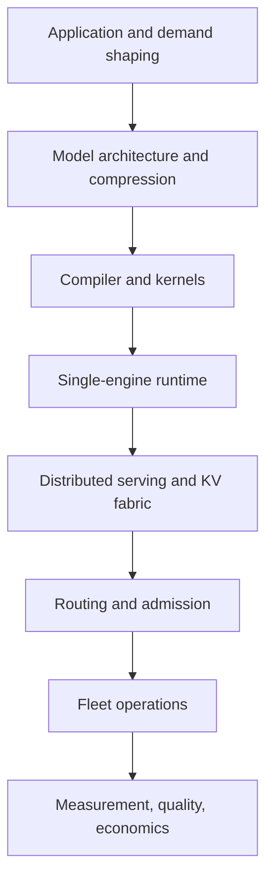

General engines are crowded and move quickly. Durable opportunities are more likely where proprietary data and workflow knowledge accumulate:

- Workload-specific optimization and release safety
- SLO/cost/quality decisions from production traces
- Operational control planes around open-source engines
- Vertical or edge deployments with unusual constraints
- Model/quantization certification using domain evaluation

## 6.2 Buyer And Pain

| Buyer | Pain | Proof they will believe |
|---|---|---|
| AI-native CTO | Inference destroys margin | Cost per successful task falls |
| ML platform lead | Too many configurations | Reproducible Pareto frontier |
| Inference SRE | Tail latency and failures | Lower p95/p99 and errors under load |
| Product owner | Slow user workflow | Better end-to-end task latency/conversion |
| FinOps | Idle committed GPUs | Fully loaded utilization and savings |
| Regulated platform owner | Private deployment risk | Audit, isolation, rollback, SLA |
| Edge/OEM lead | Device fragmentation | Device-matrix pass rate, memory, energy |

## 6.3 Metrics A Founder Must Own

\[
cost\_per\_1M\_output=
10^6\frac{fully\ loaded\ cost}{generated\ output\ tokens}
\]

\[
cost\_per\_good\_request=
\frac{fully\ loaded\ cost}{requests\ meeting\ quality\ and\ SLO}
\]

\[
goodput\_per\_accelerator\_hour=
\frac{good\ requests}{accelerator\ hours}
\]

Fully loaded cost includes:

- Accelerator, CPU, and RAM
- Storage and network
- Idle and warm capacity
- Failed and retried work
- Commitments/reservations
- Operational labor

Do not compare different models using tokens per dollar alone. Compare accepted outcomes.

## 6.4 Benchmark Rules

1. Preserve input/output length distributions and their correlation.
2. Preserve arrival burstiness and multi-turn timing.
3. Report startup stages separately: process launch, checkpoint read, device placement, JIT/autotuning, graph capture, first request, and steady state.
4. Pin model, tokenizer, template, runtime commit, driver, hardware, and flags.
5. Measure open-loop arrival rates, not only closed-loop concurrency.
6. Include errors, cancellations, retries, and timeouts.
7. Report p50/p95/p99 TTFT and TPOT/ITL with definitions.
8. Clear or control prefix caches between intended cold tests.
9. Run repeated trials and retain raw results.
10. Measure quality after every compression or model change.

## 6.5 Capstone: Inference Economics CI

Do **not** build another inference engine in six weeks.

Build an engine-neutral optimization and release-control layer.

### Input

- Redacted production trace or realistic workload specification
- vLLM/SGLang endpoint or managed API
- TTFT, TPOT, error, and quality SLO
- Hardware/API price sheet

### Output

- Reproducible baseline
- Cost/SLO/quality Pareto frontier
- Regression gate for runtime, model, quantization, or hardware changes
- Ranked recommendations with confidence
- API-versus-self-host comparison

### Privacy-preserving trace schema

Store:

- Arrival timestamp
- Prompt token count
- Output token count
- Shared-prefix identifier or salted hash
- Model and adapter identity
- TTFT, TPOT, completion status
- Cache hit tokens
- Quality/task result
- Cost attribution

Do not export raw prompts by default.

### Six-week build plan

| Week | Founder outcome |
|---|---|
| 1 | Interview 10-12 platform/SRE/AI-native buyers; choose one workload and SLO |
| 2 | Reproduce one runtime baseline and write the measurement contract |
| 3 | Build trace normalization and open-loop replay |
| 4 | Add quality and fully loaded cost; produce Pareto comparisons |
| 5 | Add CI regression reports and local redaction/collection |
| 6 | Run two design-partner replays and ask for a paid pilot |

### Validation thresholds

- Install and first report in under 30 minutes
- Three prospects willing to provide redacted traces
- Detect one real regression or show at least 15% cost reduction at unchanged SLO and quality
- One prospect willing to pay for continuous monitoring, not a one-off benchmark

Stop or pivot if the saving is one-time, trace access is impossible, or built-in tooling is sufficient.

## 6.6 Startup Wedges

### Candidate initial wedges to validate

1. **Inference optimization CI:** release gates for runtime/model/hardware changes
2. **Workload replay and SLO-cost optimizer:** production-shaped benchmarking and recommendations
3. **Quantization certification:** domain quality, hardware matrix, signed artifacts
4. **Agentic KV governance:** tenant-safe reuse, cost attribution, cache policy observability
5. **Edge deployment CI:** model packaging and release testing across a device matrix

### Weak standalone wedges

- Another generic benchmark dashboard
- Routing only on public API price
- Another general-purpose inference server without a major architectural breakthrough
- Static benchmark leaderboards that decay with every runtime release

### Moat

Open source:

- Trace collector and redaction agent
- Workload schema
- Runtime adapters
- Reproducibility metadata
- Local reports

Proprietary:

- Longitudinal workload-to-configuration data
- Quality/SLO policy engine
- Actual cost and outcome models
- Recommendation history and causal comparisons
- Enterprise workflow, approvals, and audit

Your data asset should connect:

> workload shape -> configuration -> SLO -> quality -> actual cost -> product outcome

---

# Profiling Playbooks

## Apple M2 Pro

Your machine: Apple M2 Pro, 16 GB unified memory.

Start with a 1B-3B model or a quantized local model. A 7B FP16 model is about 14 GB in weights alone and leaves too little safe headroom.

Install full Xcode for Instruments:

```bash
sudo xcode-select --switch /Applications/Xcode.app/Contents/Developer
sudo xcodebuild -runFirstLaunch
xcrun xctrace list templates
```

Record a trace:

```bash
xcrun xctrace record \
  --template 'Metal System Trace' \
  --output mps_decode.trace \
  --launch -- "$VIRTUAL_ENV/bin/python" labs/04_mps_inference_profile.py --profile
open mps_decode.trace
```

If unavailable, inspect template names and use `Game Performance`.

Useful counters/APIs:

```python
torch.mps.current_allocated_memory()
torch.mps.driver_allocated_memory()
torch.mps.recommended_max_memory()
```

System checks:

```bash
vm_stat 1
memory_pressure -Q
sudo powermetrics --samplers cpu_power,gpu_power,thermal --show-process-gpu --sample-rate 500
```

`powermetrics` values are estimates and should not be compared across different machines as exact energy measurements.

## NVIDIA CUDA

System timeline:

```bash
nsys profile \
  --trace=cuda,nvtx,osrt \
  --sample=none \
  --output=llm_system \
  python labs/05_cuda_transfer_profile.py
```

Inspect:

- GPU idle gaps
- `cudaMemcpyAsync`
- HtoD/DtoH copies
- Synchronization calls
- Copy/compute overlap
- Tiny repeated kernels

Kernel diagnosis:

```bash
ncu \
  --nvtx \
  --nvtx-include 'decode_token/' \
  --kernel-name 'regex:.*attention.*|.*gemm.*' \
  --section SpeedOfLight \
  --section MemoryWorkloadAnalysis \
  --section Occupancy \
  --section SchedulerStats \
  --launch-count 1 \
  python your_inference_script.py
```

Nsight Compute may replay kernels and change cache/concurrency behavior. Use it to explain one kernel, not to report service throughput.

Warm up first and label the intended range with NVTX. Confirm the selected kernel name in Nsight Systems before collecting expensive counters.

---

# Founder Review Questions

You should answer each without notes.

## Fundamentals

1. Derive KV bytes per token for MHA, GQA, and MQA.
2. Why is cached decode still linear in context length?
3. Why can prefill be compute-bound while decode is bandwidth-bound?
4. What does FlashAttention change, and what does it not change?
5. Why does batching improve weight reuse?
6. Why is Apple unified memory not equivalent to infinite VRAM?

## Systems

7. What problem does PagedAttention solve?
8. When does prefix caching help, and how can it leak information?
9. When is KV offload a bad idea?
10. What does continuous batching parallelize?
11. Why can decode-first scheduling starve TTFT?
12. When does prefill/decode disaggregation lose?
13. Why can CUDA graphs improve latency without reducing FLOPs?

## Founder

14. Which metric is your buyer already paying to improve?
15. Why cannot a public benchmark predict that buyer's production cost?
16. What proprietary data improves your product over time?
17. Which component should remain open source to earn trust?
18. What would cause you to stop building the startup?

---

# Sources

Primary and official sources are preferred. Version-sensitive implementation claims should be rechecked before a product decision.

1. Vaswani et al., *Attention Is All You Need*: https://arxiv.org/abs/1706.03762
2. Shazeer, *Fast Transformer Decoding: One Write-Head Is All You Need*: https://arxiv.org/abs/1911.02150
3. Ainslie et al., *GQA*: https://arxiv.org/abs/2305.13245
4. Pope et al., *Efficiently Scaling Transformer Inference*: https://arxiv.org/abs/2211.05102
5. Dao et al., *FlashAttention*: https://arxiv.org/abs/2205.14135
6. Kwon et al., *PagedAttention*: https://arxiv.org/abs/2309.06180
7. Yu et al., *Orca*: https://www.usenix.org/conference/osdi22/presentation/yu
8. Agrawal et al., *Sarathi-Serve*: https://arxiv.org/abs/2403.02310
9. Zhong et al., *DistServe*: https://arxiv.org/abs/2401.09670
10. Leviathan et al., *Fast Inference from Transformers via Speculative Decoding*: https://arxiv.org/abs/2211.17192
11. Chen et al., *Accelerating LLM Decoding with Speculative Sampling*: https://arxiv.org/abs/2302.01318
12. Hooper et al., *KVQuant*: https://arxiv.org/abs/2401.18079
13. Liu et al., *KIVI*: https://arxiv.org/abs/2402.02750
14. NVIDIA CUDA Programming Guide: https://docs.nvidia.com/cuda/cuda-programming-guide/
15. NVIDIA GPU Performance Background: https://docs.nvidia.com/deeplearning/performance/dl-performance-gpu-background/index.html
16. NVIDIA Nsight Systems User Guide: https://docs.nvidia.com/nsight-systems/UserGuide/index.html
17. NVIDIA Nsight Compute Profiling Guide: https://docs.nvidia.com/nsight-compute/ProfilingGuide/index.html
18. PyTorch Profiler: https://docs.pytorch.org/docs/stable/profiler.html
19. PyTorch pinned memory and non-blocking transfers: https://docs.pytorch.org/tutorials/intermediate/pinmem_nonblock.html
20. PyTorch MPS: https://docs.pytorch.org/docs/stable/notes/mps.html
21. Apple PyTorch on Metal: https://developer.apple.com/metal/pytorch/
22. Apple Metal storage modes: https://developer.apple.com/documentation/metal/choosing-a-resource-storage-mode-for-apple-gpus
23. MLX unified memory: https://ml-explore.github.io/mlx/build/html/usage/unified_memory.html
24. Google TPU architecture: https://cloud.google.com/tpu/docs/system-architecture-tpu-vm
25. Hugging Face cache strategies: https://huggingface.co/docs/transformers/main/en/kv_cache
26. vLLM architecture: https://docs.vllm.ai/en/stable/design/arch_overview/
27. vLLM PagedAttention design (historical implementation note): https://docs.vllm.ai/en/latest/design/paged_attention/
28. vLLM automatic prefix caching: https://docs.vllm.ai/en/stable/design/prefix_caching/
29. vLLM quantized KV cache: https://docs.vllm.ai/en/stable/features/quantization/quantized_kvcache.html
30. SGLang paper / RadixAttention: https://arxiv.org/abs/2312.07104
31. llama.cpp: https://github.com/ggml-org/llama.cpp
32. MLPerf Inference: https://github.com/mlcommons/inference

---

# Final Principle

Inference optimization is not a bag of tricks.

It is the practice of turning a workload into a resource model, proving the limiting resource with measurements, and changing the system without breaking quality or the SLO.

That is also the basis of a credible company.
